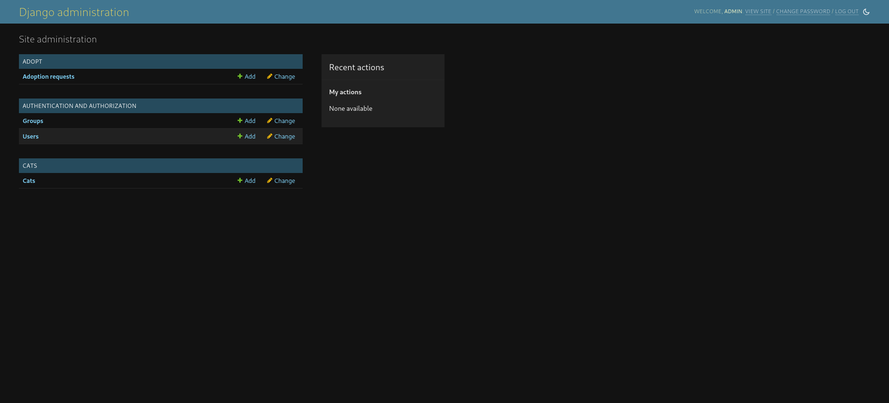

# django-cat-adoption
A toy website where you can adopt cats, made with Django. A large number of unit tests
is also included.

## To visit the website:

1) Run Django's HTTP server (the default port is 8000) using:
```
python manage.py runserver
```

2) Visit the website in localhost:8000

## To run the unit tests
```
python manage.py test
```

## User-side


The part of the site intended for ordinary users (adopters) is straightforward
and includes functionality such as:

- Registration & Authentication
  


- Searching for cats based on a number of criteria such as age, sex or color
  


- Viewing the details page for a cat and placing an adoption request (via the "Adopt" button)
  


- Viewing the adoption requests, which might be pending, approved or rejected
  


- Viewing a special details page for cat that has been adopted by the user
  


## Staff-side

Staff users can login to the admin page ```localhost:8000/admin``` and 
perform most administrative actions. You can use the premade staff user
with the credentials:
```
Username: bot
Password: abojus112
```
to test these functions yourself.


A staff user can:

- Add a new cat
  


- Change the status of an adoption request from pending to approved or rejected (once
an adoption request for a cat by a user is approved, all other requests for the same
cat are rejected automatically)


## Admin-side

The admin user has the credentials:
```
Username: admin
Password: admin
```
and can do everything the staff users can, but also edit user information and
change their permissions.




The admin can make any user into a member of the staff by adding them into the "Staff"
group. By doing so, they will automatically be granted access to the admin page.


